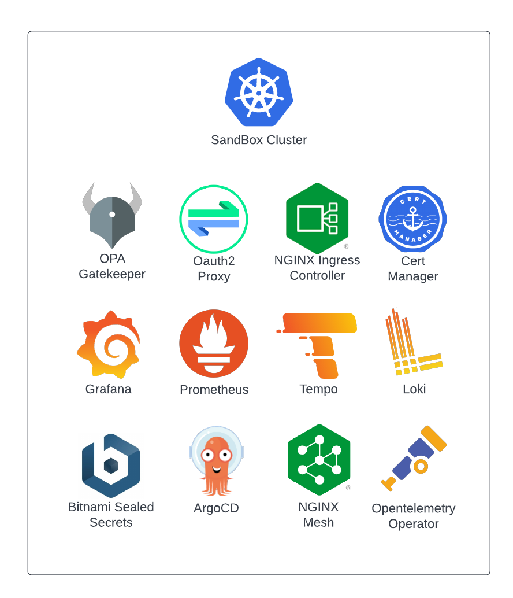

# Sandbox

## Background

The Sandbox project is an opinionated set of apps that can be applied to a Kubernetes Cluster to
give it some of the common functionality you might expect to find in a "production-ready" cluster
(e.g. observability, ingress, gitops tooling, key vault, service mesh, etc), without all of the "pesky" rigor
and strict policy enforcement. In other words, a development and experimentation sandbox that lives
somewhere between a vanilla k8s cluster and one you should actually run user facing service on.

---
**Warning**

> To Be Clear: while many of the necessary components are installed with an example configuration, 
> it must be stressed that this is **NOT** intended to carry production traffic.

---

## Quick Links
* [Sandbox Documentation](https://clhain.github.io/sandbox/)
* [Getting Started](https://clhain.github.io/sandbox/installation/choose-a-method/)
* [Frequently Asked Questions](https://clhain.github.io/sandbox/faq/)

## What's Included

**A default Sandbox installation includes the following apps and services:**

|               App/Service                 |               Description                 |
|-------------------------------------------|-------------------------------------------|
| [ArgoCD](https://argo-cd.readthedocs.io/) | Provides "GitOps" functionality and handles installation of Sandbox services |
| [Cert Manager](https://cert-manager.io/)  | Provides automated certificate management |
| [Grafana](https://grafana.com/)           | Visualize and explore telemetry from cluster and applications |
| [Loki](https://grafana.com/oss/loki/)     | Backend for storage and retrieval of container logs. |
| [NGINX Ingress Controller](https://docs.nginx.com/nginx-ingress-controller/) | Provides cluster ingress services via NGINX Inc Ingress |
| [NGINX Mesh](https://www.nginx.com/products/nginx-service-mesh/) | Provides service mesh functionality |
| [Oauth2 Proxy](https://oauth2-proxy.github.io/oauth2-proxy/) | Uses common identity providers for authentication to ingress resources |
| [OPA Gatekeeper](https://github.com/open-policy-agent/gatekeeper) | Define and enforce policies on your K8S infrastructure |
| [Opentelemetry Operator](https://github.com/open-telemetry/opentelemetry-operator) | Collect and forward metrics / logs / traces from cluster services |
| [Prometheus Operator](https://github.com/prometheus-operator/prometheus-operator) | Collect metrics from cluster and installed applications |
| [Sealed Secrets](https://github.com/bitnami-labs/sealed-secrets) | Secured secrets for k8s infrastructure |
| [Tempo](https://grafana.com/oss/tempo/)   | Backend for storage and retreival of distributed tracing data. |

**A default Sandbox installation includes the following capabilities "out of the box":**

* **Container ingress services** via NGINX Ingress Controller.
* **Automated Let's Encrypt SSL** certificate generation for ingress services (NGINX Ingress + Cert Manager).
* **Oauth2 Authentication** with common identity providers for users accessing ingress services (NGINX Ingress + Oauth2 Proxy).
* **GitOps** based application deployments (ArgoCD).
* **Service mesh** capabilities (NGINX Mesh).
* **On-board telemetry** collection and visualization (Grafana, Prometheus, Opentelemetry, Loki, Tempo).
* **Policy Definition and Enforcement** with Open Policy Agent Gatekeeper.
* **Secure Secret Management** patterns with Bitnami Sealed Secrets.

## Project Structure

    bundle/     # Cloud Native App Bundle (Porter.sh) definitions.
    docs/       # Documentation files (this site).
    examples/   # Example deployment files for different installation scenarios.
    service/    # Definition files for installed applications.