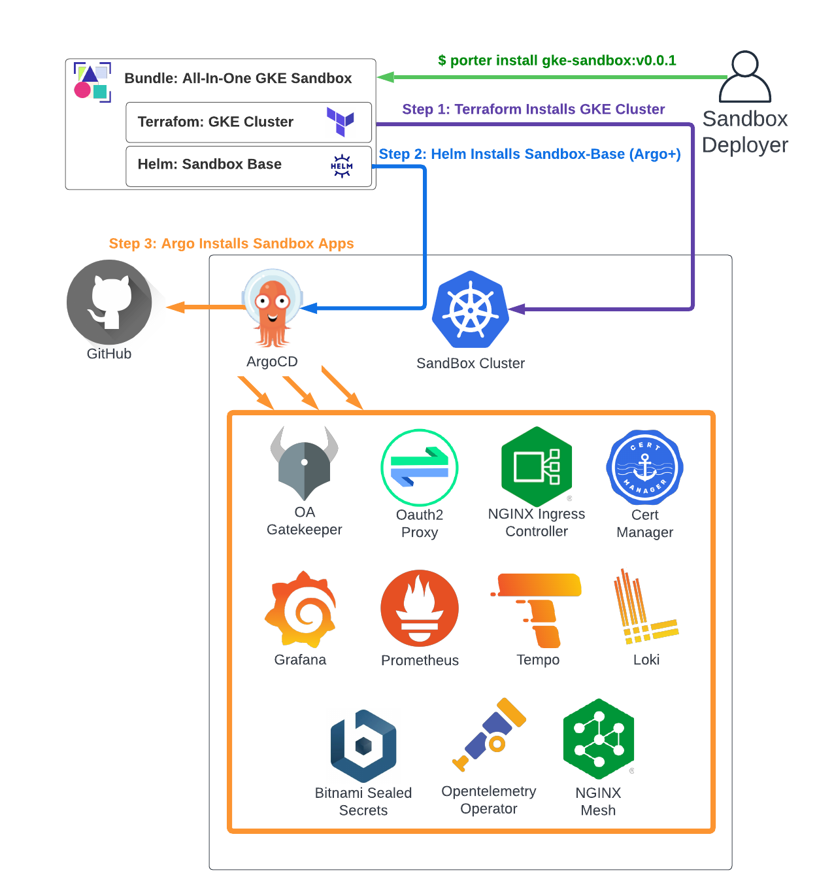

# All-In-One Installation On GKE

The All-In-One installation uses Porter based CNAB bundles to deploy the cluster
and Sandbox applications / services in a single command. If you're not familiar with
Porter/CNAB, think of it as a docker container for your deployment pipelines - allowing
you to compose multiple tools (e.g. helm, terraform, bash) into a single image with a common
interface, that can be versioned, etc, just like an application container.

In this case, the bundle does 2 things:

1. Invoke terraform to provision a Private GKE Cluster with the parameters passed to it via Porter.
2. Invoke Helm to install the [sandbox-base](https://github.com/clhain/sandbox-helm-charts/tree/main/charts/sandbox-base)
chart (which installs ArgoCD + Sandbox Argo App definitions) on top of the cluster from #1.



Below assumes a non-customized installation of the bundle. For more information on customizing included
services, see [Customizing Default Services](../customization/default-services.md).

---

## 1. Install Porter

Follow the Porter [Installation Guide](https://getporter.org/install/) to install the recommended v1
release on the machine which you wish to deploy the bundle from.

---

## 2. GKE Specific Pre-Reqs
You'll need the following available prior to deployment of the All-In-One GKE Sandbox Bundle in order to
deploy the cluster:

1. A GCP Project ([Instructions](https://cloud.google.com/resource-manager/docs/creating-managing-projects)).
2. A Service Account and json key to Use For Deploying the cluster (see [Porter Deployer Service Account](#porter-deployer-service-account) below).
3. (Optional) - A pre-existing Service Account name (key not required) to assign to the deployed nodes in the cluster (see [Cluster Node Service Account](#cluster-node-service-account) below).


### Porter Deployer Service Account
A [GCP service account JSON key](https://cloud.google.com/iam/docs/creating-managing-service-accounts#creating) is required to deploy the bundle.

Required permissions for the deployer Service Account are:

* Compute Admin
* Compute Network Admin
* Kubernetes Engine Admin
* Kubernetes Engine Cluster Admin
* Service Account User

If you're not using the default compute engine service account or bringing a pre-existing SA, the deployer will also need
Service Account Creator permissions.

Example account creation and permission commands (must be run by a user with permissions to create service accounts):
```text
gcloud iam service-accounts create porter-deployer-sa \
    --description="Service Account Used with Porter to deploy GCP assets" \
    --display-name="Porter Deploy Service Account"

gcloud projects add-iam-policy-binding PROJECT_ID \
    --member="serviceAccount:porter-deployer-sa@PROJECT_ID.iam.gserviceaccount.com" \
    --role="roles/iam.serviceAccountUser"

gcloud projects add-iam-policy-binding PROJECT_ID \
    --member="serviceAccount:porter-deployer-sa@PROJECT_ID.iam.gserviceaccount.com" \
    --role="roles/container.admin"

gcloud projects add-iam-policy-binding PROJECT_ID \
    --member="serviceAccount:porter-deployer-sa@PROJECT_ID.iam.gserviceaccount.com" \
    --role="roles/container.clusterAdmin"

gcloud projects add-iam-policy-binding PROJECT_ID \
    --member="serviceAccount:porter-deployer-sa@PROJECT_ID.iam.gserviceaccount.com" \
    --role="roles/compute.networkAdmin"

gcloud projects add-iam-policy-binding PROJECT_ID \
    --member="serviceAccount:porter-deployer-sa@PROJECT_ID.iam.gserviceaccount.com" \
    --role="roles/compute.admin"
```

If you're not using the default compute engine service account or bringing a pre-existing SA:
```text
gcloud projects add-iam-policy-binding PROJECT_ID \
    --member="serviceAccount:porter-deployer-sa@PROJECT_ID.iam.gserviceaccount.com" \
    --role="roles/iam.serviceAccountCreator"
```

### Cluster Node Service Account (Optional)
If you elect to use the default compute engine service account (not required), or want to use a pre-existing
service account for the Node Pool, you can specify it as a parameter to the installation bundle.
The name of the service account can be passed as a parameter, no json key is required.

If the cluster needs access to Google Container Registry associated with the project, add the Storage Object Reader
permission (or permissions for any other GCP resources to be accessed by the nodes).

Example gcloud commands:
```text
gcloud iam service-accounts create sandbox-cluster-1-node-sa \
    --description="Service Account For GKE Cluster Nodes" \
    --display-name="Cluster Node Service Account"

# Optional additional permissions
gcloud projects add-iam-policy-binding PROJECT_ID \
    --member="serviceAccount:sandbox-cluster-1-node-sa@PROJECT_ID.iam.gserviceaccount.com" \
    --role="roles/storage.objectViewer"
```

---

## 3. Sandbox Common Pre-Reqs

In addition to the GCP specific pre-reqs, you'll also need the following for all default functionality:

* A subdomain to use with the deployment and access to create DNS records.
* An email address to use as contact info for Let's Encrypt Certificates.
* OIDC Client information from your identity provider.

Read more about these in the dedicated [Common Pre-Reqs](pre-reqs.md) page.

---

## 4. Configure Porter

We strongly recommend managing porter installations via the ["Desired State" mode](https://getporter.org/quickstart/desired-state/).
With this mode, you'll configure a few files that specify where porter can find the parameters and
credentials needed to perform the deployment, and then invoke the installation itself through a series
of 'Apply' commands.

We recommend setting up a new project with cluster specification as follows:

```text
your_project/
    cluster/
        creds.yaml           # Credentials spec for bundle installation
        params.yaml          # Parameters spec for bundle installation
        installation.yaml    # Installation spec
        sandbox-values.yaml  # Helm values to pass to sandbox-base helm chart installation
```

You can copy the files in the [Example Cluster Directories](https://github.com/clhain/sandbox/tree/main/examples/simple-app-boutique/cluster)
and modify them as needed.

### Porter Credentials File

The **creds.yaml** file contains references to where porter can find the sensitive parameters (e.g. passwords, keys, etc)
needed to perform the install. An example declaration might look like this:

```yaml
schemaVersion: 1.0.1
name: sandbox-cluster-1            # The name of the porter credential set that will be created
credentials:
  - name: gcloud_key_file          # The name of the credential that is passed to the bundle
    source:                        # Where to find the value for the credential
      path: /tmp/cloud.key         # This specifies that the gcloud-key-file parameter comes from the path /tmp/cloud.key
  - name: oidc_client_secret       # The name of the credential that is passed to the bundle
    source:                        # Where to find the value for the credential
      env: OIDC_CLIENT_SECRET      # This specifies that the oidc_client_secret parameter comes an environment variable named OIDC_CLIENT_SECRET
```

Place your Deployment Service Account Key from step 2 above in /tmp/gcloud.key (or the location of your choice, updating the file).

Set the value of OIDC_CLIENT_SECRET to your key value from step 3 above.

`export OIDC_CLIENT_SECRET=YOUR_CLIENT_SECRET_VALUE`

### Porter Parameters File

The **params.yaml** file contains references to non-sensitive configuration values to use for bundle installation.
An example declaration might look like:

```yaml
schemaVersion: 1.0.1
name: sandbox-cluster-1
parameters:
  - name: name
    source:
      value: sandbox-cluster-1
  - name: domain
    source:
      value: #### YOUR_DOMAIN_HERE ####
  - name: node_service_account_id
    source:
      value: sandbox-cluster-1-node-sa  # Create this 
  - name: gcp_project
    source:
      value: #### YOUR_GCP_PROJECT_ID_HERE ####
  - name: oidc_email_domains
    source:
      value: #### YOUR_EMAIL_DOMAIN_ALLOW_LIST_HERE (e.g. f5.com) ####
  - name: oidc_client_id
    source:
      value: #### YOUR_OIDC_CLIENT_ID_HERE ####
  - name: oidc_issuer_url
    source:
      value: #### YOUR_OIDC_ISSUER_URL_HERE ####
  - name: letsencrypt-contact-email
    source:
      value: #### YOUR_CONTACT_EMAIL_HERE ####
  - name: sandbox-values
    source:
      path: ./sandbox-values.yaml
```

Replace all instances of #### YOUR_X_HERE #### with the values obtained in steps 2 and 3 above.
For additional parameters supported by the bundle, you can run `porter explain {{ sandbox_porter_gke_repo }}:v{{ extra.sandbox_porter_gke_version }}`
from the command line.

### Porter Installation File

The **installation.yaml** file contains information about what credentials and parameters should
be applied to a given installation of a particular bundle. If you re-named the credential or parameter sets
from the values above, you'll need to update these values, otherwise the below should work without
modification:

```yaml
schemaVersion: 1.0.1
name: sandbox-cluster-1
bundle:
  repository: {{ sandbox_porter_gke_repo }}
  version: v{{ extra.sandbox_porter_gke_version }}
parameterSets:
  - sandbox-cluster-1
credentialSets:
  - sandbox-cluster-1
```

### Sandbox Values File

The **sandbox-values.yaml** file contains additional helm values to pass to the installation of the
sandbox-base charts, which are deployed automatically once the cluster is installed. The helm
chart installs argo-cd to the new cluster, and then adds an ArgoCD Application spec which handles
deployment of all Sandbox applications / services. See the [Default Service Configuration](../customization/default-services.md)
guide for more info.

It's strongly recommended to include the following snippet in the values file tailored for your
OIDC Provider. ArgoCD doesn't support the use of the Oauth2 proxy for authenticating users and
must use it's own built-in Oauth mechanisms. See their documentation for provider specific configs,
the below works for Azure AD.

```yaml
argo-cd:
  server:
    rbacConfig:
    config:
      url: ### YOUR ARGOCD HOSTNAME (https://argocd.YOUR_DOMAIN/ with default settings)
      oidc.config: |
        name: AzureAD
        issuer: ### YOUR OIDC ISSUER URL ####
        clientID: $oauth-secret:oidc.clientId
        clientSecret: $oauth-secret:oidc.clientSecret
        requestedIDTokenClaims:
          groups:
            essential: true
        requestedScopes:
          - openid
          - profile
          - email
```

> Note: Argo uses the $oauth-secret:oidc.clientId and $oauth-secret:oidc.clientSecret references to find
> the client ID and secret from an existing K8S Secret (installed automatically in sandbox-base). You don't need to replace
> those values if you're using the default install settings.

## 5. Install The Bundle

Once the params file is updated and the credentials are put in place (see above), the installation is
straightforward:

```yaml
porter creds apply cluster/creds.yaml
porter parameters apply cluster/params.yaml
porter installations apply cluster/installation.yaml
```

The GKE cluster will be deployed, and the initial Argo Installation will occur. Following that,
the individual sandbox components will be installed by ArgoCD over the next 10-20 minutes. You can
track the installation progress after connecting to the cluster with:

`kubectl get application -n argocd`

Once you see the following, you should be good to go:

```text
NAME                       SYNC STATUS   HEALTH STATUS
argo-virtual-server        Synced        Healthy
cert-manager               Synced        Healthy
grafana                    Synced        Healthy
loki                       Synced        Healthy
nginx-ingress              Synced        Healthy
nginx-mesh                 Synced        Healthy
oauth-proxy                Synced        Healthy
opentelemetry-operator     Synced        Healthy
prometheus-operator        Synced        Healthy
prometheus-operator-crds   Synced        Healthy
sandbox-apps               Synced        Healthy
temppo                     Synced        Healthy
```

## 5. Access Sandbox Services
Once all services are in 'Synced, Healthy' state, and you've updated the DNS records as described [here](dns.md),
you should be able to securely access the ArgoCD and Grafana services at:

```text
https://argocd.YOUR_DOMAIN/
https://grafana.YOUR_DOMAIN/
```

Please see the [troubleshooting](../troubleshooting.md) guide for investigating issues.