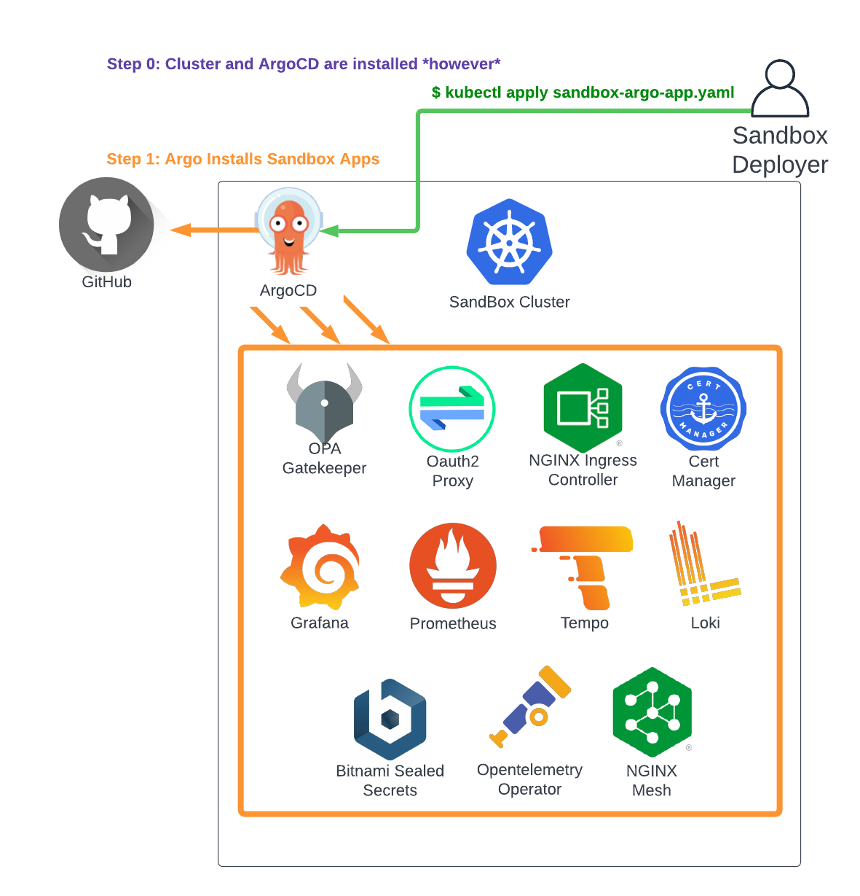

# Bring Your Own Cluster (ArgoCD)

If you already have a cluster ready to deploy the Sandbox apps set to, you can do so with:

* ArgoCD - this guide, if ArgoCD is already installed.
* Helm - if ArgoCD is not installed (see [Bring Your Own Cluster Helm](byoc-helm.md)).

> Note: It's recommended not to have existing services on the destination sandbox cluster to avoid
> collisions or other compatibility issues. ArgoCD should be safe however, if you wish to manage it
> via some other process.




## 0. Pre-Requisites
See the guide for [Common Sandbox Pre-Reqs](pre-reqs.md) for the set of parameters you'll need to have available.

In short, they include:

```
clusterDomain:             # e.g. yourdomain.com
clusterIngressIP:          # e.g. 1.2.3.4
oidcClientID:              # e.g. some-client-id
oidcClientSecret:          # e.g. some-secret-value
oidcIssuerURL:             # e.g. "https://login.microsoftonline.com/TENANT/v2.0"
oidcPermittedEmailDomains: # e.g. "yourdomain.com"
letsEncryptContactEmail:   # e.g. "someone@yourdomain.com"
```

## 1. Configure The Application.yaml

We need to pass an ArgoCD Application spec to the cluster that details how to find and deploy the sandbox services.
Copy the [Example Bring Your Own Cluster Spec (Argo)](https://github.com/clhain/sandbox/tree/main/examples/bring-your-own-cluster/install-with-argo.yaml)
and modify as needed. 

The values look like this, and the spec.source.helm.parameters must be set based on the values gathered in step 0:

```
---
apiVersion: argoproj.io/v1alpha1
kind: Application
metadata:
  name: sandbox-cluster-apps
  namespace: argocd   ## YOUR ARGOCD NAMESPACE
spec:
  destination:
    server: https://kubernetes.default.svc
    namespace: argocd   ## YOUR ARGOCD NAMESPACE
  project: default      ## YOUR ARGOCD PROJECT
  source:
    repoURL: https://github.com/clhain/sandbox-helm-charts.git
    path: charts/sandbox-apps
    targetRevision: HEAD
    helm:
      parameters:
        - name: clusterDomain
          value:                              # YOUR CLUSTER DOMAIN (e.g. example.com)
        - name: clusterIngressIP
          value:                              # YOUR CLUSTER Ingress IP (e.g. 1.2.3.4)
        - name: oidcClientID
          value:                              # YOUR OIDC Client ID String
        - name: oidcClientSecret
          value:                              # YOUR OIDC Client Secret String
        - name: oidcIssuerURL
          value:                              # YOUR OIDC ISSUER URL (e.g. "https://login.microsoftonline.com/TENANT/v2.0") 
        - name: oidcPermittedEmailDomains
          value: "*"                          # YOUR PERMITTED OIDC EMAIL DOMAINS (e.g. example.com)
        - name: letsEncryptContactEmail
          value:                              # YOUR LETS ENCRYPT CONTACT EMAIL (e.g. nobody@example.com)
        - name apps.argo-virtual-server.enabled
          value: false                        # Turn off the ArgoCD Virtual server assuming it's already exposed via manual process.
  syncPolicy:
    automated:
      prune: true
      selfHeal: true

```

Additional customization is possible via the helm parameters. See [Customizing Default Services](../customization/default-services.md) for more info.

## 2. Install The Sandbox ArgoCD Application

```
kubectl apply -f /path/to/your/application.yaml
```

Following that, the individual sandbox components will be installed by ArgoCD over the next 10-20 minutes. You can
track the installation progress after connecting to the cluster with:

`kubectl get application -n argocd`

Once you see the following, you should be good to go:

```
NAME                       SYNC STATUS   HEALTH STATUS
argo-virtual-server        Synced        Healthy
cert-manager               Synced        Healthy
grafana                    Synced        Healthy
loki                       Synced        Healthy
nginx-ingress              Synced        Healthy
nginx-mesh                 Synced        Healthy
oauth-proxy                Synced        Healthy
opentelemetry-operator     Synced        Healthy
prometheus-operator        Synced        Healthy
prometheus-operator-crds   Synced        Healthy
sandbox-apps               Synced        Healthy
temppo                     Synced        Healthy
```


## 3. Access Sandbox Services
Once all services are in 'Synced, Healthy' state, and you've updated the DNS records as described [here](dns.md),
you should be able to securely access the ArgoCD and Grafana services at:

* https://argocd.YOUR_DOMAIN/
* https://grafana.YOUR_DOMAIN/

Please see the [troubleshooting](../troubleshooting.md) guide for investigating issues.