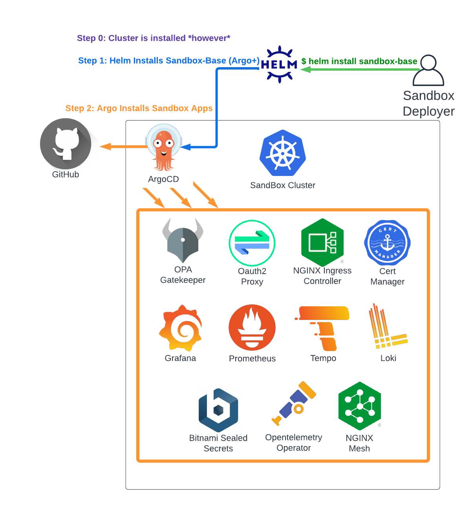

# Bring Your Own Cluster (HELM)

If you already have a cluster ready to deploy the Sandbox apps set to, you can do so with:

* Helm - this guide, which installs ArgoCD and the Sandbox -
* ArgoCD - if it's already installed (see [Bring Your Own Cluster (ArgoCD)](byoc-argocd.md)) -



## 0. Pre-Requisites
See the guide for [Common Sandbox Pre-Reqs](pre-reqs.md) for the set of parameters you'll need to have available.

In short, they include:

```
clusterDomain:             # e.g. yourdomain.com
clusterIngressIP:          # e.g. 1.2.3.4
oidcClientID:              # e.g. some-client-id
oidcClientSecret:          # e.g. some-secret-value
oidcIssuerURL:             # e.g. "https://login.microsoftonline.com/TENANT/v2.0"
oidcPermittedEmailDomains: # e.g. "yourdomain.com"
letsEncryptContactEmail:   # e.g. "someone@yourdomain.com"
```

## 1. Install Helm

See the Helm [Installation Guide](https://helm.sh/docs/intro/install/) for instructions.

## 2. Add the Sandbox Chart Repo

```
helm repo add sandbox-charts https://clhain.github.io/sandbox-helm-charts
```

## 3. Configure the installation values.yaml

We need to pass a custom values.yaml file to the helm install command to set the parameters gathered in step 0 above.
Copy the [Example Bring Your Own Cluster Config](https://github.com/clhain/sandbox/tree/main/examples/bring-your-own-cluster/install-with-helm-values.yaml)
and modify as needed. 

The values look like this:

```
clusterDomain:             # e.g. yourdomain.com
clusterIngressIP:          # e.g. 1.2.3.4
oidcClientID:              # e.g. some-client-id
oidcClientSecret:          # e.g. some-secret-value
oidcIssuerURL:             # e.g. "https://login.microsoftonline.com/TENANT/v2.0"
oidcPermittedEmailDomains: # e.g. "yourdomain.com"
letsEncryptContactEmail:   # e.g. "someone@yourdomain.com"


## Any application specifc parameter overrides can be passed to the cluster here.
## See the documentation section for customizing installation parameters for more info.
## This sets the nginx-ingress helm chart controller.image.tag to 2.3.0.
# paramOverrides:
#   apps.nginx-ingress.source.helm.params.nginx-ingress.controller.image.tag: 2.3.0

## Uncommenting the following and update with your OIDDC ISSUER URL and ARGOCD HOSTNAME is strongly recommended
# argo-cd:
#   server:
#     rbacConfig:
#     config:
#       url: ### YOUR ARGOCD HOSTNAME (https://argocd.YOUR_DOMAIN/ with default settings)
#       oidc.config: |
#         name: AzureAD
#         issuer: ### YOUR OIDC ISSUER URL ####
#         clientID: $oauth-secret:oidc.clientId
#         clientSecret: $oauth-secret:oidc.clientSecret
#         requestedIDTokenClaims:
#           groups:
#             essential: true
#         requestedScopes:
#           - openid
#           - profile
#           - email
```

The first 7 are required for a default install. The OIDC configuration section under argo-cd.server OIDC configs are strongly recommended
to prevent public access to the (read only) ArgoCD gui.

## 4. Install The Sandbox Base Helm Chart

```
helm upgrade --install sandbox sandbox-charts/sandbox-base --namespace argocd --values sandbox-values.yaml --wait --atomic --create-namespace
```

Following that, the individual sandbox components will be installed by ArgoCD over the next 10-20 minutes. You can
track the installation progress after connecting to the cluster with:

`kubectl get application -n argocd`

Once you see the following, you should be good to go:

```
NAME                       SYNC STATUS   HEALTH STATUS
argo-virtual-server        Synced        Healthy
cert-manager               Synced        Healthy
grafana                    Synced        Healthy
loki                       Synced        Healthy
nginx-ingress              Synced        Healthy
nginx-mesh                 Synced        Healthy
oauth-proxy                Synced        Healthy
opentelemetry-operator     Synced        Healthy
prometheus-operator        Synced        Healthy
prometheus-operator-crds   Synced        Healthy
sandbox-apps               Synced        Healthy
temppo                     Synced        Healthy
```

## 5. Access Sandbox Services
Once all services are in 'Synced, Healthy' state, and you've updated the DNS records as described [here](dns.md),
you should be able to securely access the ArgoCD and Grafana services at:

* https://argocd.YOUR_DOMAIN/
* https://grafana.YOUR_DOMAIN/

Please see the [troubleshooting](../troubleshooting.md) guide for investigating issues.