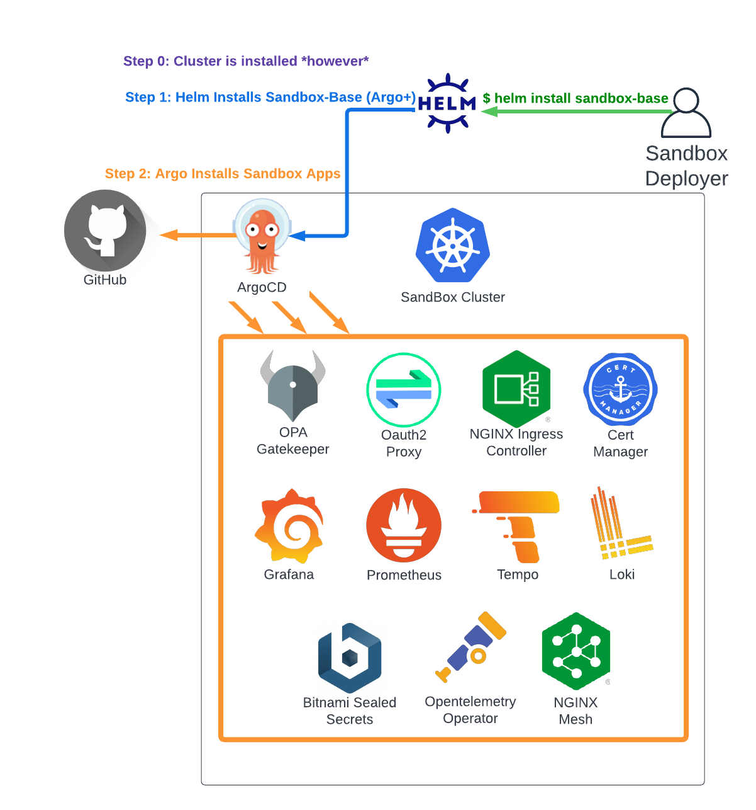

# Choose An Installation Method

The Sandbox environment can be deployed several ways, depending on your needs.
Generally, this is broken down into whether or not you want to have the cluster deployed as part
of the installation process, or you already have one available to you.

## All-In-One Install

The Sandbox project uses [Porter](https://porter.sh/) based [Cloud Native Application Bundles](https://cnab.io/)
which can combine the deployment of the cluster with the steps to apply the sandbox application set. 

You can use this method if:

1. You have an account with one of the supported providers
2. Have limited requirements for how the cluster needs to be configured (e.g. node size, location, count, and destination VPC).

For more advanced requirements, it's recommended to deploy the cluster manually, and then add the Sandbox apps with one of the
Bring Your Own Cluster methods below.

Currently, the following infrastructure providers are supported:

* Google Cloud ([GKE Sandbox Quickstart](all-in-one-gke.md))

## Bring Your Own Cluster

If you already have a cluster available, there are 2 ways to layer the Sandbox on top:

* [Helm Based Install](byoc-helm.md) (ArgoCD is installed as part of the deployment)
* [ArgoCD Based Install](byoc-argocd.md) (ArgoCD is already installed on the cluster)

In either case, it's strongly recommended that the cluster contain no services
(other than ArgoCD for the second method) prior to installation of the Sandbox in order to reduce risk of conflicts.

### Using Helm
There's a "Sandbox Base" Helm chart available that will deploy Argo and the full stack of Sandbox Apps to 
a pre-existing cluster. You should use this method if you have a cluster, but don't have ArgoCD installed on it.

See more: [Helm Based Install](byoc-helm.md)

### Using ArgoCD
If you have a cluster with ArgoCD deployed already, you can install the Sandbox application stack directly
via ArgoCD application spec.

* See more: [ArgoCD Based Install](byoc-argocd.md)