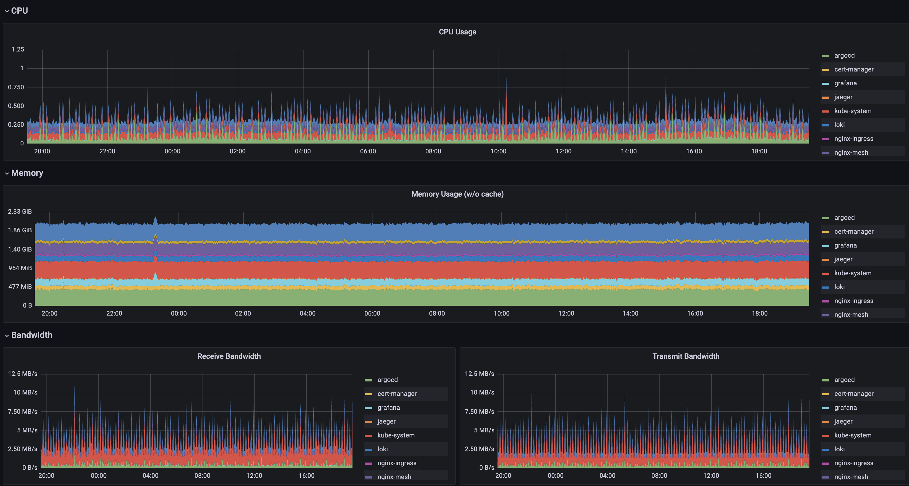

# Sandbox Pre-Requisites

The following things are required to enable all Sandbox functionality. The [Quick Start](quick-start.md) based
install (using kind) has no up-front requirements, but some features won't work. The requirements here are common
for all fully-featured installations regardless of the install methd. Additional installation specific
requirements can be found in the dedicated guides for the All-In-One and Bring Your Own Cluster guides.

## Cluster Requirements

### Node Resources

The default Sandbox cluster resource utilization at idle is approximately as follows (3 node GKE cluster with e2-standard-2 nodes):



Size your nodes taking these baseline performance stats and the specific requirements of your additional apps / services into account.


### Cluster Ingress IP

The Container ingress service requires a static IP address for use with service host records (see DNS section below).

***Alternatives***
In order to use the Lets Encrypt certificate issuer, the IP must be publicly accessible for the HTTP verification process.
If you don't wish to use this feature, you can either:

* Disable the TLS endpoints with helm argument --set clusterTLSInsecure=true
* Modify the cert-manager or virtual-servers to work with alternate settings (see [Customizing Default Services](../customization/default-services.md))


## DNS Zone and Records Access

In order to direct external traffic to Sandbox cluster services (and any you'll add
yourself), you'll need to have a DNS domain and administrative access to create host records.

There are many different services available for this, and we make no specific recommendations.

See the [DNS Configuration](dns.md) guide for more info. If you're installing the Sandbox via Porter bundle,
you'll have to wait until the cluster is created to find the ingress IP assigned.

***Alternatives***
If you don't have an available DNS domain, you can use a service like [nip.io](https://nip.io) which automatically
directs `*.[your-ip].nip.io` to the ip specified by setting the Cluster Domain to `[your-ip].nip.io` at install time.
This method isn't compatible with Automatic SSL Certs from LetsEncrypt, so you'll also need to either:

* Disable the TLS endpoints with helm argument `--set clusterTLSInsecure=true`
* Modify the cert-manager or virtual-servers to work with alternate settings (see [Customizing Default Services](../customization/default-services.md))

## Let's Encrypt Contact Email

Automated SSL certificate generation via Cert Manager and Let's Encrypt requires an
email be provided so they can contact someone regarding problems with the cert, etc.
There is no requirement that the email address be associated with a Let's Encrypt account, it
can just be any email address you have access to.

You don't need to provide this if you're using an alternate Cluster Issuer or have disabled TLS endpoints.

## OIDC Client Configuration

The default sandbox installation comes with [Dex](https://https://dexidp.io/) and a pre-configured admin account. The process for using an external
identity provider is as follows:

The Oauth2 Proxy documents has excellent [provider-specific instructions](https://oauth2-proxy.github.io/oauth2-proxy/docs/configuration/oauth_provider)
for obtaining the needed values and configuring the provider for use. In general, you'll need the following:

1. The OIDC Client ID from the provider.
2. The OIDC Client Secret from the provider.
3. The OIDC Issuer URL for the provider.

### Authorized Redirects

You'll also need to set the following redirect locations as authorized for the client:

```text
https://argocd.YOURDOMAIN.COM/auth/callback
https://auth.YOURDOMAIN.COM/oauth2/callback
```

See the [Oauth2 Proxy](https://github.com/clhain/sandbox/services/oauth-proxy/README.md) doc in this repo for more information.